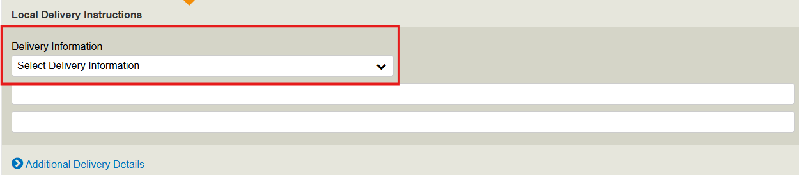

# Creating a Delayed Report

## Check the [Pre-check List Info before](../pre-check-list-info.md) starting a Delay Report

When you are opening World tracer you need to choose: Delayed Bag – Create

Select Station and Airline

## Passenger Identification

Family Name: Last Name, Given Name: First Name, Title: Mr / Ms and Preferred Language:  2 letters.

## Passenger Reservation Details

PNR Number and Number of Passengers (Recommended).

## Permanent Contact Information

Country, Postal Code, City, Address Line: Street Name and house or department Number. Very important to write mobile phone number on Home/Business Phone and Cell Phone, so passenger can receive a SMS with Report Number. And is very important also to write Email, so can receive confirmation of Delayed Report. there is a choice to add more than one phone number and email.

## Automated Messages

Message Options select 2. Receive both SMS & email, 
and Immediate Message select 1. Proactive

## Temporary Contact Information

Country, Postal Code, City, Address Line: if the passenger stays on hotel, so we need a Hotel Name and Address, Valid Until Date: very important write the date leaving the Temporary address, and Valid Until Time: the time leaving the Temporary address, and phone: we need hotel phone number.

## Bag

everything is mandatory except Rush Tag Number is (recommended). Max 10 bags you can add per report.

### Flight 
## Passenger Routing

Flight, Date, Origin: Departure Station and Destination: Arrival Station. And you can add more routes from Add another flight.

## Bag Routing
Flight: (information on bagtag if passenge rebooked) and Date. And you can add more routes from Add another flight.

### Delivery

## Local Delivery Instructions

Very important to Select the correct Delivery type. the most popular delivery type is:

- To Permanent address
- To temporary address
- To be collected (if the passenger wants to collect the bag be his self from airport)
- Must be collected (Curtesy Report)

# More 

## Further Information / Supplementary Information

Further Information and Supplementary Information for Public information.

## Extra Information

Extra Information for internal use (not Public).

***Be sure at you fill all the pages and all information is added correctly***

