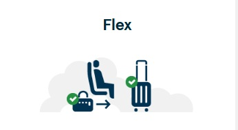
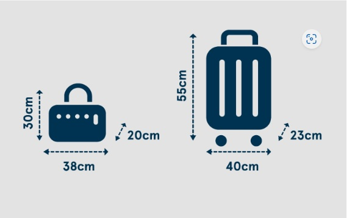

# Hand baggage

Everyone can bring one underseat bag to be stored under the seat in front. If you’re travelling on a LowFare+ or Flex ticket, you can also bring one overhead cabin bag.

Your ticket type determines your allowance
Be sure to measure your bags and remember that it’s the combined weight of your hand baggage that counts!

## Lowfare

- **Max weight limit 10 kg** 
- **Underseat bag (30x20x38cm)** 

## Lowfare+

**Combined weight limit of 10 kg.**

- **Max weight limit 10 kg** 
- **Underseat bag (30x20x38cm)** 

## Flex

**Combined weight limit of 15 kg**

- **Underseat bag (30x20x38cm)** 
- **Overhead cabin bag (55x40x23cm)** 

## Good to know

- Everyone can also bring **one airport shopping bag** in addition to their ticket type allowance.
- Pack important items, such as medicine, baby items and your valuables in your underseat bag.
- Some items are not allowed in your hand baggage – please check our [restricted items]() before you pack.
- You can bring an item instead of a standard bag (such a gift box or mini board), but it must not exceed our hand baggage limits or be listed among our restricted items/dangerous goods.

