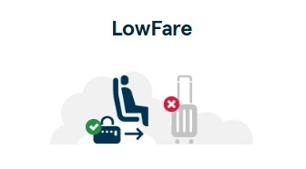
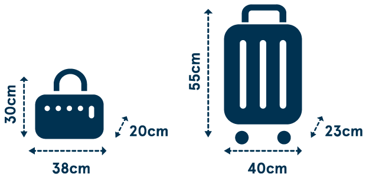

## Hand baggage

Everyone can bring one underseat bag to be stored under the seat in front. If you’re travelling on a LowFare+ or Flex ticket, you can also bring one overhead cabin bag.

Your ticket type determines your allowance
Be sure to measure your bags and remember that it’s the combined weight of your hand baggage that counts!

## Lowfare

- **Max weight limit 10 kg** 
- **Underseat bag (30x20x38cm)** 

## Lowfare+

- **Max weight limit 10 kg** 
- **Underseat bag (30x20x38cm)** 

## Good to know
- Everyone can also bring **one airport shopping bag** in addition to their ticket type allowance.

